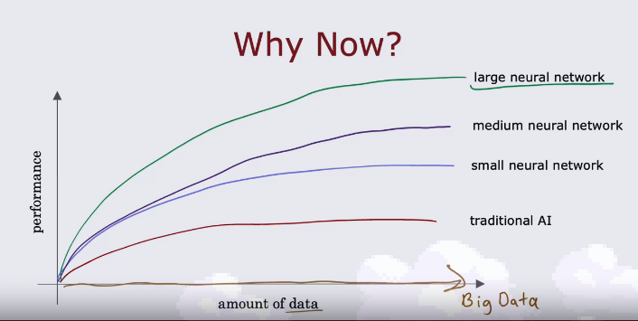
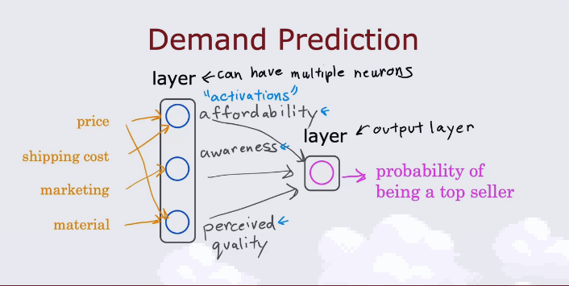
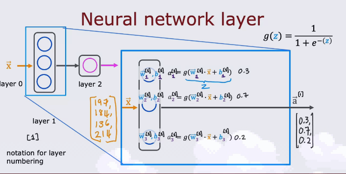
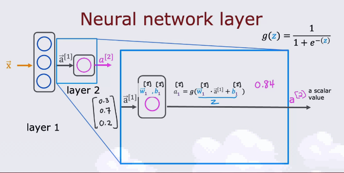
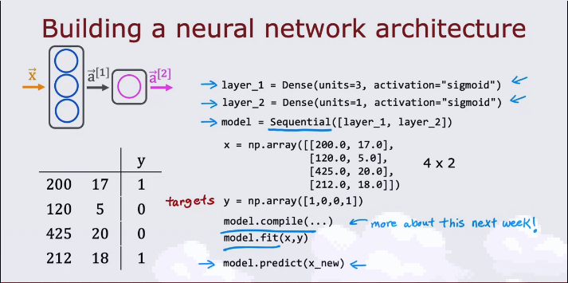
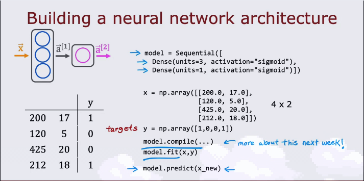
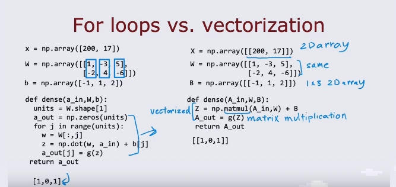

<mark>

# Advanced Learning Algorithms

#### Neural networks
* **Algorithms that try to mimic the brain.**
* How does the brain work?  
    * A biological neuron has inputs from other neurons in the form of electric impulses.
    * This biological neuron then does some computation and outputs an impulse via its axon to another neuron.  
* The amount of data we have now is more than ever before. With modern AI algorithms, we can use very large neural networks to produce high performing AI tools
  
##### Demand Prediction
* Think of the following model as a single neuron. The neuron takes a single input x and outputs the probability of being a top seller.

* Think of creating the following neural network model in order to predict the probability of being a top seller.

* This neural network inputs 4 numbers into the first layer which inputs 3 numbers into the second layer which outputs the probability of being a top seller.
* This is all a neural network is. It takes some input into the input layer. It passes the input through some "hidden" layers and passes it through the output layer to give an output.  

##### Neural Network layer 
* In our first neural network layer, we pass the input and perform the logistic regression function with certain weights $w_i, b_i$ to get outputs. We then pass these outputs as inputs into our second layer. This layer again performs logistic regression analysis with certain w,b values in order to give out a scalar output **a** as our final result.

* You can choose to add a final threshold value and check if our scalar output is greater than or less than the threshold you want a binary output.  

* **Notation for activation layer:** $a_j^{[l]} = g(\vec{w_j}^{[l]}.\vec{a}^{[l-1]} + b_j^{[l]})$
    * g = activation function aka sigmoid function
##### Forward Propagation
* We pass the initial input $\vec{x}$ into layer one, which outputs $\vec{a}^{[1]}$ 
* Now $\vec{a}^{[1]}$ is an input to layer two. This process continues till the output of the final layer. After which we make a decision based on the value of the output of the final layer.
* Typically the number of variables decreases as we move forward in the layers.
* This process is called *forward propagation*

##### TensorFlow
* To make a Neural Network in TensorFlow, create the initial input array x in python.
* Create Layers using the dense function e.g.- layer_1 = Dense(units = 3, activation = 'sigmoid')
* get output a1 = layer_1(x), Now a1 is input to layer_2 and a2 is the output of that layer.
* If a2 is the final output then make prediction based on the value of a2.

##### Building a neural network architecture in TensorFlow 

###### Vectorization

