<style>
mark{
    background-color: '#E5CFCB';
    text-align: left;
    font-size: 20px;
    font-family: Times New Roman;
}
</style>

<mark>

# Machine Learning Notes

##### Machine Learning
* Field of study that gives computers the ability to learn 
    without being explicitly programmed.

###### Types of Machine Learning Algorithms
1. Supervised Learning  
2. Unsupervised learning  
The more opportunities you give a computer, the better it will perform.
###### Supervised Learning
*   Algorithms that learn input to output.  
*   Learns from being given "right answers".  

Two major types of Supervised Learning:  
        1. Regression - Predicts Numbers  
        2. Classification - Predicts Categories

###### Unsupervised Learning

    Find something interesting in unlabeled data.

    Types of Unsupervised Learning:
        1. Clustering
        2. Anomaly Detection
#
###### Linear Regression Model

    Data Table: Comprises of Input x (Graphed on X Axis) and Output y (Graphed on Y Axis)

Notation:
x = input, y = output, m = no. of training examples  
 (x,y) = single training  
 (x<sup>i</sup>, y<sup>i</sup>) = i<sup>th</sup> training example

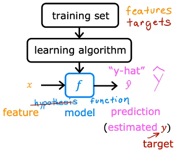

###### How to represent f?

 $f_{w,b}(x^{i})= wx^{i} + b$  
 $f(x^{i}) = wx^{i} + b$  
**w, b : parameters / coefficients**
#### Linear Regression with one variable / Univariate linear regression


Note: $\hat{y}^{(i)} = f_{w,b}(x^{i})$

The output of our linear regression model is represented by $\hat{y}$

The actual value / target for the given x parameter is represented by $y$.

###### Cost Function

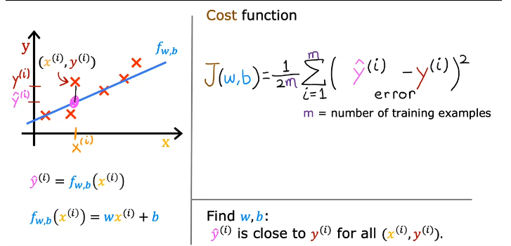

$J(w,b) = \frac{1}{2m}\sum_{i=1}^{m}(\hat{y}^{(i)} - y^{(i)})^{2}$

m = no. of training examples

By convention, we divide by 2m and not m.

> model: $f_{w,b}(x^{i})= wx^{i} + b$  
> parameters: w,b  
> cost function:$J(w,b) = \frac{1}{2m}\sum_{i=1}^{m}(\hat{y}^{(i)} - y^{(i)})^{2}$  
> goal: minimize $J(w,b)$

By simplifying f by setting b = 0, $f_{w}(x) =wx$

Now, $J(w) = \frac{1}{2m}\sum_{i=1}^{m}(\hat{y}^{(i)} - y^{(i)})^{2}$

Our goal becomes to find a value of w which minimizes $J(w)$

Similarily, for $f_{w,b}(x^{i})= wx^{i} + b$, our goal becomes to find a value of w,b which minimizes
$J(w,b)

#

#### Gradient Descent Algorithm

Overview:  
    Have some function $J(w,b)$     
    Want $w,b$ so we get $min(J(w,b))$

> Outline:  
> Start with some $w,b$ (set w = 0, b =0)  
> Keep changing $w,b$ to reduce $J(w,b)$ until we settle at or reach a minimum

**Algorithm**:

 repeat until convergence {     
  $tmp_w = w -  \alpha\frac{d}{dw}J(w,b)$  
  $tmp_b = b - \alpha\frac{d}{db}J(w,b)$  
  $w = tmp_w$  
  $b = tmp_b$  
 }

Notation: $\alpha$ = learning rate, $\alpha$ is always +ve

> Note: make sure you update w and b simultaneously

> when slope of J(w) v w is positive,$\alpha\frac{d}{dw}J(w)$ is positive, so w decreases  
> when slope of J(w) v w is negative,$\alpha\frac{d}{dw}J(w)$ is negative, so w increases

- If alpha is too small, gradient descent may be slow.
- If alpha is too large, gradient descent may lead to a huge step by which you may overstep the minimum.

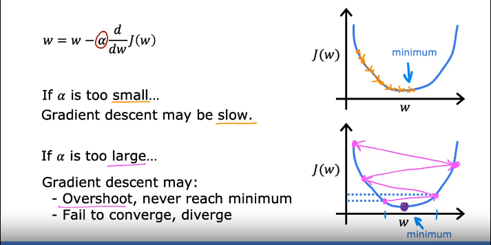

If w is at a local minimum, then slope is 0, so the next temp_w is w. So we put a check to see if current w is previous w and if it is the same then we end our algorithm.
If the sign of the previous slope is not equal to the current slope than that means we overstepped and our learning rate was too large.

#### Gradient Descent for Linear Regression

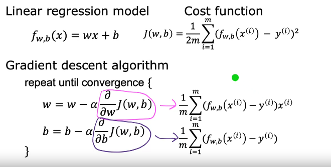

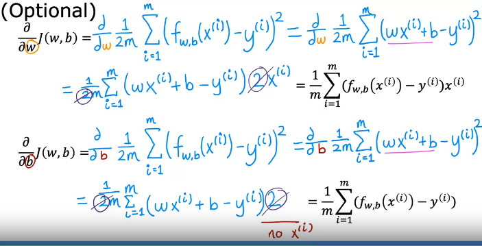  
#### Batch Gradient Descent:  
"Batch": Each set of gradient descent uses all the training examples.
    
```py
def gradient_descent(x, y, w_in, b_in, alpha, num_iters, cost_function, gradient_function): 
    """
    Performs gradient descent to fit w,b. Updates w,b by taking 
    num_iters gradient steps with learning rate alpha
    
    Args:
      x (ndarray (m,))  : Data, m examples 
      y (ndarray (m,))  : target values
      w_in,b_in (scalar): initial values of model parameters  
      alpha (float):     Learning rate
      num_iters (int):   number of iterations to run gradient descent
      cost_function:     function to call to produce cost
      gradient_function: function to call to produce gradient
      
    Returns:
      w (scalar): Updated value of parameter after running gradient descent
      b (scalar): Updated value of parameter after running gradient descent
      J_history (List): History of cost values
      p_history (list): History of parameters [w,b] 
      """
    
    # An array to store cost J and w's at each iteration primarily for graphing later  
    J_history = []
    p_history = []
    b = b_in
    w = w_in
    
    for i in range(num_iters):
        # Calculate the gradient and update the parameters using gradient_function
        dj_dw, dj_db = gradient_function(x, y, w , b)     

        # Update Parameters using equation (3) above
        b = b - alpha * dj_db                            
        w = w - alpha * dj_dw                            

        # Save cost J at each iteration
        if i<100000:      # prevent resource exhaustion 
            J_history.append( cost_function(x, y, w , b))
            p_history.append([w,b])
        # Print cost every at intervals 10 times or as many iterations if < 10
        if i% math.ceil(num_iters/10) == 0:
            print(f"Iteration {i:4}: Cost {J_history[-1]:0.2e} ",
                  f"dj_dw: {dj_dw: 0.3e}, dj_db: {dj_db: 0.3e}  ",
                  f"w: {w: 0.3e}, b:{b: 0.5e}")
 
    return w, b, J_history, p_history #return w and J,w history for graphing


```
**If there are multiple features / variables you have multiple $x_is$**   
> We define:  
    w = [ w1, w2, w3, w4 ...... wn]  
    b is a number  
    x = [x1, x2, x3 .......xn]  
    $f_{w,b}(x) = \vec{w}.\vec{x} + b$

<br>

##### Vectorization

Without vectorization, we have to use a for loop  
With vectorization, gradient descent is as simple as:

```python
f = np.dot(w,x) + b
```
Vectorized algorithms scale well to large datasets.
This is because it relies on parallel computing (a feature of modern computers).

##### Gradient Descent for multiple Linear Regression
repeat {  
${w_j = w_j - \alpha\frac{\partial}{\partial w}J(\vec{w}, b) }$  
${b = b - \alpha\frac{\partial}{\partial w}J(\vec{w}, b) }$  
}

##### Feature Scaling

Let's say price of a house depends on two parameters: $x_1: size$, $x_2: range$  
The range of size is small, the range of price is large.

If $w_1$ > $w_2$, this could lead to unreasonable pricing in our model.

By scaling both our parameters, our contours will look more like circles and less like ovals.


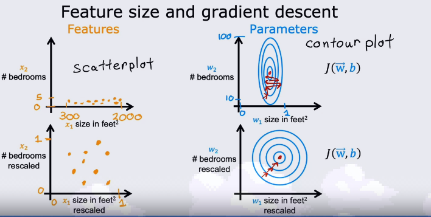  

One way of scaling is dividing by the maximum value. Another is mean normalization.  

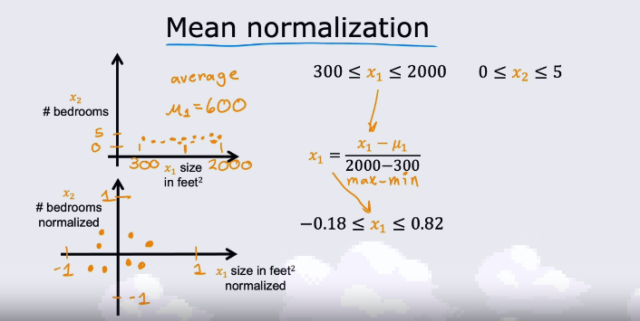

The last method is Z-score normalization.


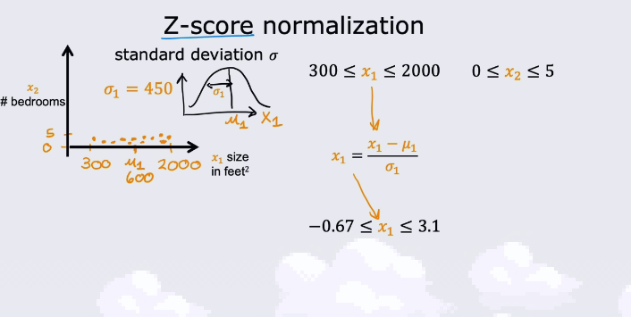  

**Make sure gradient descent is working clearly. Our objective is to reach the minimum of $J(\vec{w},b).$  
 The value of J should decrease after every iteration.**  

You can set an automatic convergence test of a specific $\epsilon$ value and if the change in J is less than that you can claim gradient descent to have completed.  

##### Feature Engineering


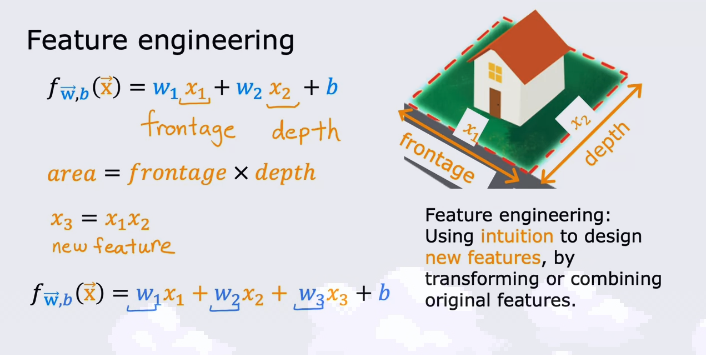  

Sometimes, creating new features with their own weightage can improve your model and give a better fit for your data.

#### Polynomial Regression

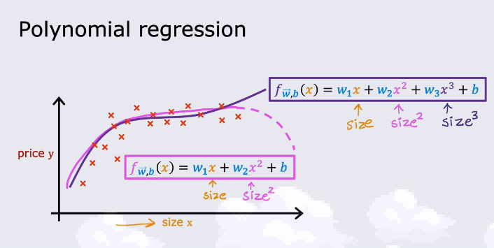 

Sometimes a curved line is a better fit as a model for out data. For this, we can use polynomial regression.  
#

**Linear Regression is not a good algorithm for classification problems.**  
In Classification, y can only be one of two values - yes/no.  

#### Logistic Regression

* Sigmoid / Logistic Function - $g(z) = \frac{1}{1+ e^{-z}} \{ 0 < g(z) < 1\}$
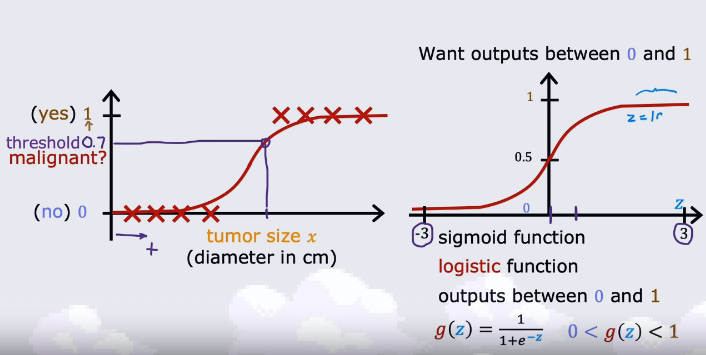

For our given weights: $z = \vec{w}.\vec{x} + b$

* **Logistic Regression - "probability that class is 1"**  

* **Decision Boundary** - The Line / Curve about which the prediction changes.  
* **Cost function for Logistic regression -**  
    * Let us define the logistic loss function L  
    * if $y^{(i)} = 1:$ $L = -log(f_{\vec{w},b}(\vec{x}^i))$  
    * if $y^{(i)} = 0:$ $L = -log(1 - f_{\vec{w},b}(\vec{x}^i))$  
    * **$J(\vec{w},b) = \frac{1}{m}\sum{L(f_{\vec{w},b}(\vec{x}^i), y^i)}{}$**

* **Simplified Loss function -**
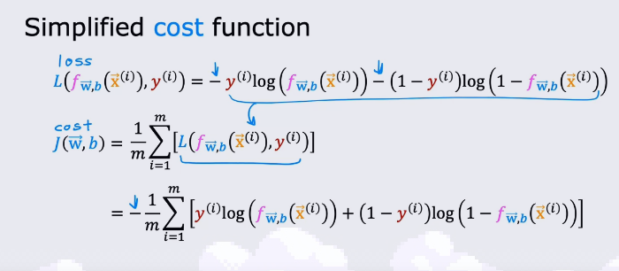  

##### Gradient Descent for Logistic Regression -  

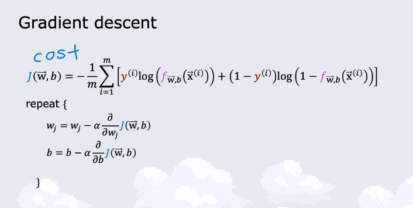  
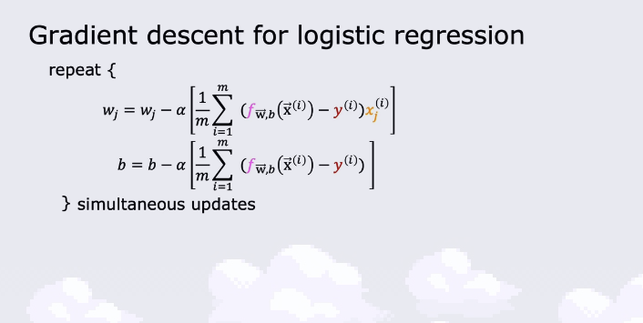  

###### Problem of Overfitting -  
* underfitting - high bias - clear pattern in the training data that the model is unable to grasp.
* generalization - fits training set pretty well
* overfitting - does extremely good job fitting the data - does not generalize to new examples added to the model - **high variance**  
###### Addressing Overfitting -  
* Collect more training examples.
* Select features to include/exclude.
* Regularization - smaller values for $w_j$

###### Cost function with regularization -
* If you have a lot of features, we don't know which features are important.
* We then regularize / penalize all the variables - less likely to overfit.

###### Regularized Linear Regression
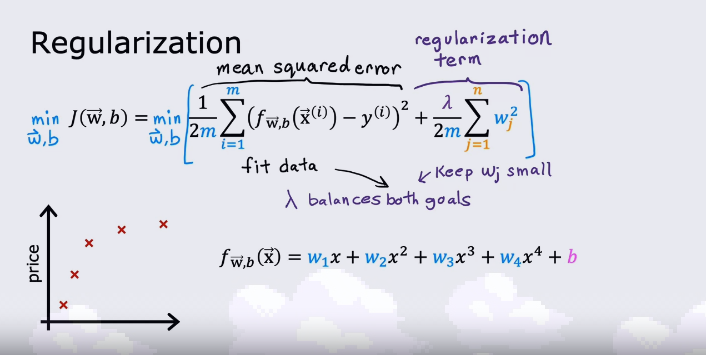  
* If $\lambda$ is very small - data will overfit.
* If $\lambda$ is very large - data will underfit.
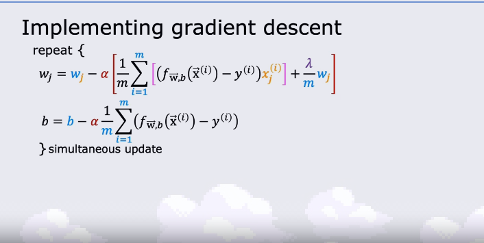  

###### Regularized Logistic Regression
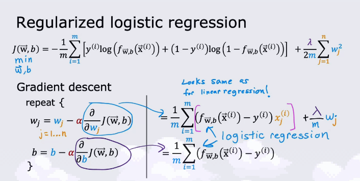  

